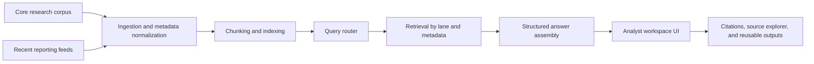

# AI Compute Intelligence

AI Compute Intelligence is a retrieval-augmented research workspace for tracking AI compute strength, infrastructure competition, export-control pressure, and supply-chain constraints. The project is designed for analysts who need to combine durable research with fresh reporting and turn that evidence into structured, citation-backed outputs.

The goal is not to build another generic chatbot. The goal is to create an analyst workspace that helps users ask better questions about AI compute, inspect source grounding, compare actors, monitor developments, and produce reusable briefings.

## What This Project Demonstrates

- Retrieval-augmented generation design for a strategic technology domain
- Separation between stable research and fast-moving current reporting
- Metadata-aware source organization for policy, infrastructure, and market analysis
- A Next.js and TypeScript frontend scaffold for an analyst-facing RAG workspace
- Structured answer rendering with citations, source inspection, and reusable output formats
- Product thinking around AI compute as a national security, business, and policy intelligence problem

## Problem

AI compute strength is difficult to analyze because the evidence base spans slow-moving research, fast-moving infrastructure announcements, corporate investment signals, export-control policy, datacenter and energy constraints, chip supply chains, and frontier-lab behavior.

Traditional search surfaces fragments. Generic chat can blur dated research with fresh claims. This project treats those evidence types as different knowledge lanes so users can understand what is durable, what changed recently, and what remains uncertain.

## Product Concept

The application uses two retrieval lanes.

| Lane | Purpose | Example Sources |
| --- | --- | --- |
| Core Research | Durable knowledge for concepts, baselines, and historical context | Think tank reports, academic research, market studies, policy papers, AI index reports |
| Recent Updates | Fresh reporting for monitoring changes and new developments | Company announcements, infrastructure news, export-control updates, earnings signals, government statements |

The answer experience is designed to route queries across these lanes based on intent.

- Conceptual questions favor Core Research.
- Recent-development questions favor Recent Updates.
- Strategic comparison questions blend both lanes.

## Example Questions

- Which factors best explain national AI compute strength?
- How do export controls affect China's access to frontier AI compute?
- Which firms appear best positioned to expand training capacity over the next 12 months?
- What recent developments changed the outlook for datacenter buildout, power access, or chip availability?
- How should analysts compare hyperscalers, frontier labs, and national AI capacity?

## Current State

This repository contains the frontend scaffold and product design for the analyst workspace. The current implementation ports the main prototype surfaces into a `Next.js + TypeScript` app shell with mock data.

Implemented surfaces:

- Home
- Workspace
- Sources
- Monitor

The UI is intentionally separated from the retrieval backend at this stage. That keeps the product shell, layout, and interaction model clear before connecting ingestion, indexing, and answer-generation services.

## Architecture Direction



## Frontend Structure

```text
app/          Next.js App Router pages and layout
components/   Reusable screen and workspace components
lib/          Typed mock data and helper functions
prototype/    Earlier dependency-free HTML, CSS, and JavaScript prototype
scripts/      Utility scripts
```

## Key Design Principles

1. Separate durable research from fresh reporting.
2. Show provenance and timestamps clearly.
3. Support natural chat and structured outputs.
4. Keep scope controls visible without making the interface rigid.
5. Let users reuse the same question in different analytic formats.

## Planned Retrieval Model

The intended backend will support:

- PDF and report ingestion
- Metadata extraction for source, date, entity, region, topic, and source type
- Semantic retrieval across the core research corpus
- Recurring update ingestion for recent developments
- Lane-aware query routing
- Citation-backed answer assembly
- Output blocks such as summary, key findings, comparison table, timeline, risks, caveats, and open questions

## Technology

- Next.js
- React
- TypeScript
- Mock data for the current frontend prototype

## Run Locally

Install dependencies and start the development server.

```powershell
npm install
npm run dev
```

Then open:

```text
http://localhost:3000
```

## Roadmap

- Connect the Workspace to a first backend query endpoint.
- Render structured answer payloads with citations.
- Add source detail views and citation drilldowns.
- Implement metadata filters for lane, date, region, entity, and topic.
- Add recurring recent-update ingestion.
- Add export-ready briefing formats.

## Portfolio Note

This project shows how RAG can support strategic intelligence rather than simple document chat. It is scoped around AI compute because the topic requires evidence separation, time-aware retrieval, structured comparison, and clear uncertainty handling.
